# Enhanced Local Connector - Architecture Diagrams

**Project**: Dex Enhanced Local Connector
**Version**: 1.0
**Last Updated**: 2025-11-18

---

## Table of Contents

1. [System Architecture](#system-architecture)
2. [Component Diagram](#component-diagram)
3. [Data Flow Diagrams](#data-flow-diagrams)
4. [Authentication Flows](#authentication-flows)
5. [Storage Architecture](#storage-architecture)
6. [Integration Architecture](#integration-architecture)

---

## System Architecture

### High-Level System Overview

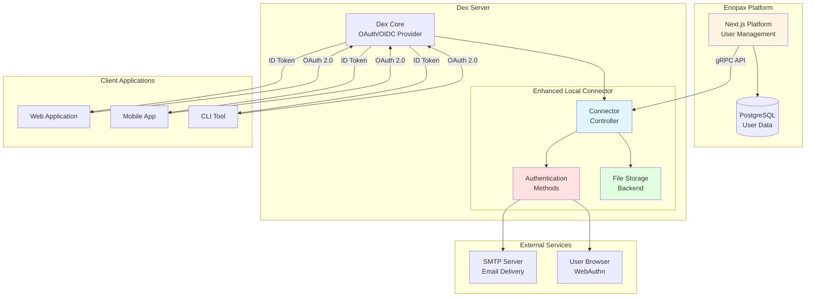
```mermaid
graph TB
    subgraph "Enopax Platform"
        Platform[Next.js Platform<br/>User Management]
        PlatformDB[(PostgreSQL<br/>User Data)]
    end

    subgraph "Dex Server"
        DexCore[Dex Core<br/>OAuth/OIDC Provider]

        subgraph "Enhanced Local Connector"
            Connector[Connector<br/>Controller]
            Auth[Authentication<br/>Methods]
            Storage[File Storage<br/>Backend]
        end
    end

    subgraph "Client Applications"
        WebApp[Web Application]
        MobileApp[Mobile App]
        CLI[CLI Tool]
    end

    subgraph "External Services"
        SMTP[SMTP Server<br/>Email Delivery]
        Browser[User Browser<br/>WebAuthn]
    end

    Platform -->|gRPC API| Connector
    Platform --> PlatformDB

    DexCore --> Connector
    Connector --> Auth
    Connector --> Storage
    Auth --> Browser
    Auth --> SMTP

    WebApp -->|OAuth 2.0| DexCore
    MobileApp -->|OAuth 2.0| DexCore
    CLI -->|OAuth 2.0| DexCore

    DexCore -->|ID Token| WebApp
    DexCore -->|ID Token| MobileApp
    DexCore -->|ID Token| CLI

    style Connector fill:#e1f5ff
    style Auth fill:#ffe1e1
    style Storage fill:#e1ffe1
    style Platform fill:#fff3e1
```

---

## Component Diagram

### Enhanced Local Connector Components

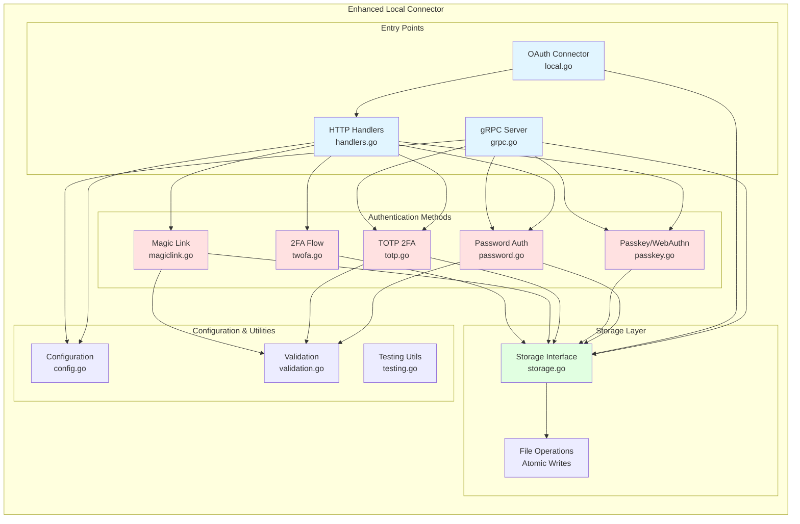
```mermaid
graph LR
    subgraph "Enhanced Local Connector"
        subgraph "Entry Points"
            HTTP[HTTP Handlers<br/>handlers.go]
            GRPC[gRPC Server<br/>grpc.go]
            OAuth[OAuth Connector<br/>local.go]
        end

        subgraph "Authentication Methods"
            Password[Password Auth<br/>password.go]
            Passkey[Passkey/WebAuthn<br/>passkey.go]
            TOTP[TOTP 2FA<br/>totp.go]
            MagicLink[Magic Link<br/>magiclink.go]
            TwoFA[2FA Flow<br/>twofa.go]
        end

        subgraph "Storage Layer"
            Storage[Storage Interface<br/>storage.go]
            FileOps[File Operations<br/>Atomic Writes]
        end

        subgraph "Configuration & Utilities"
            Config[Configuration<br/>config.go]
            Validation[Validation<br/>validation.go]
            Testing[Testing Utils<br/>testing.go]
        end

        HTTP --> Password
        HTTP --> Passkey
        HTTP --> TOTP
        HTTP --> MagicLink
        HTTP --> TwoFA

        GRPC --> Password
        GRPC --> Passkey
        GRPC --> TOTP
        GRPC --> Storage

        OAuth --> HTTP
        OAuth --> Storage

        Password --> Storage
        Passkey --> Storage
        TOTP --> Storage
        MagicLink --> Storage
        TwoFA --> Storage

        Storage --> FileOps

        Password --> Validation
        TOTP --> Validation
        MagicLink --> Validation

        HTTP --> Config
        GRPC --> Config
    end

    style HTTP fill:#e1f5ff
    style GRPC fill:#e1f5ff
    style OAuth fill:#e1f5ff
    style Password fill:#ffe1e1
    style Passkey fill:#ffe1e1
    style TOTP fill:#ffe1e1
    style MagicLink fill:#ffe1e1
    style TwoFA fill:#ffe1e1
    style Storage fill:#e1ffe1
```

---

## Data Flow Diagrams

### User Registration Flow

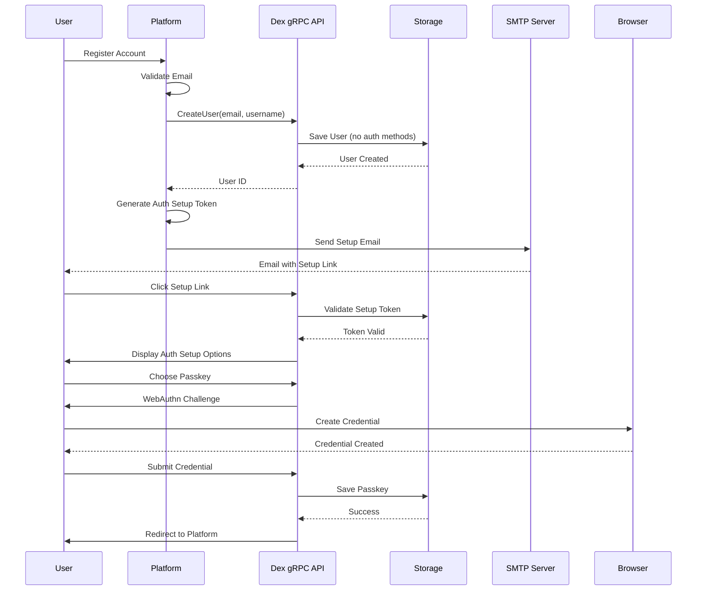
```mermaid
sequenceDiagram
    participant User
    participant Platform
    participant Dex as Dex gRPC API
    participant Storage
    participant Email as SMTP Server

    User->>Platform: Register Account
    Platform->>Platform: Validate Email

    Platform->>Dex: CreateUser(email, username)
    Dex->>Storage: Save User (no auth methods)
    Storage-->>Dex: User Created
    Dex-->>Platform: User ID

    Platform->>Platform: Generate Auth Setup Token
    Platform->>Email: Send Setup Email
    Email-->>User: Email with Setup Link

    User->>Dex: Click Setup Link
    Dex->>Storage: Validate Setup Token
    Storage-->>Dex: Token Valid
    Dex->>User: Display Auth Setup Options

    User->>Dex: Choose Passkey
    Dex->>User: WebAuthn Challenge
    User->>Browser: Create Credential
    Browser-->>User: Credential Created
    User->>Dex: Submit Credential
    Dex->>Storage: Save Passkey
    Storage-->>Dex: Success
    Dex->>User: Redirect to Platform
```

### Passkey Authentication Flow

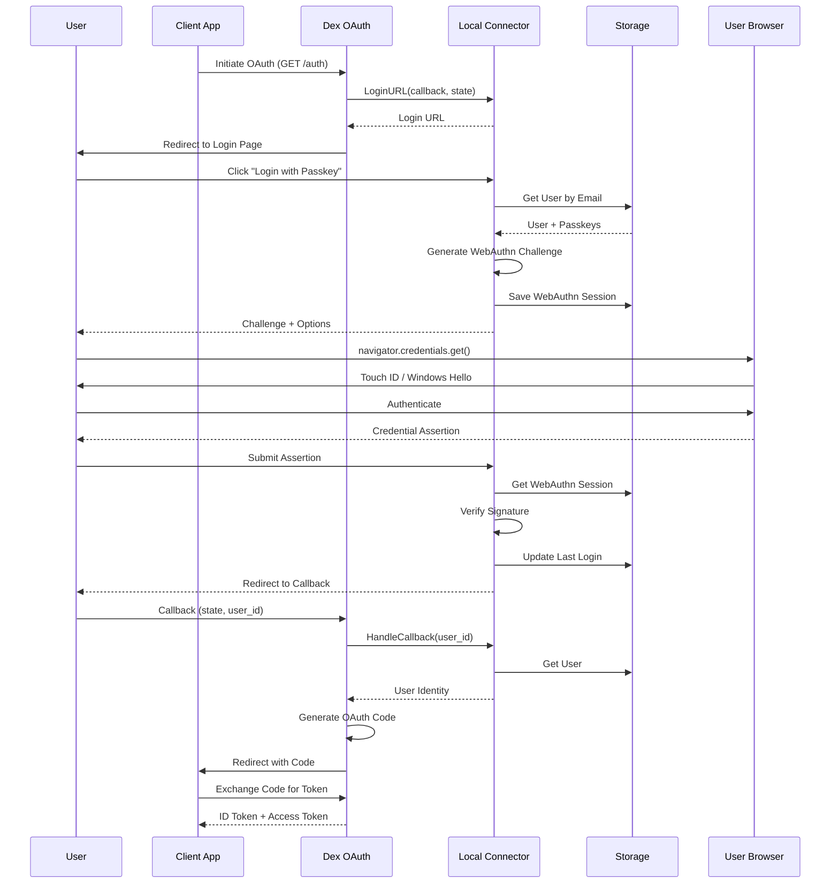
```mermaid
sequenceDiagram
    participant User
    participant App as Client App
    participant Dex as Dex OAuth
    participant Connector as Local Connector
    participant Storage
    participant Browser as User Browser

    App->>Dex: Initiate OAuth (GET /auth)
    Dex->>Connector: LoginURL(callback, state)
    Connector-->>Dex: Login URL
    Dex->>User: Redirect to Login Page

    User->>Connector: Click "Login with Passkey"
    Connector->>Storage: Get User by Email
    Storage-->>Connector: User + Passkeys

    Connector->>Connector: Generate WebAuthn Challenge
    Connector->>Storage: Save WebAuthn Session
    Connector-->>User: Challenge + Options

    User->>Browser: navigator.credentials.get()
    Browser->>User: Touch ID / Windows Hello
    User->>Browser: Authenticate
    Browser-->>User: Credential Assertion

    User->>Connector: Submit Assertion
    Connector->>Storage: Get WebAuthn Session
    Connector->>Connector: Verify Signature
    Connector->>Storage: Update Last Login
    Connector-->>User: Redirect to Callback

    User->>Dex: Callback (state, user_id)
    Dex->>Connector: HandleCallback(user_id)
    Connector->>Storage: Get User
    Connector-->>Dex: User Identity

    Dex->>Dex: Generate OAuth Code
    Dex->>App: Redirect with Code

    App->>Dex: Exchange Code for Token
    Dex-->>App: ID Token + Access Token
```

### Two-Factor Authentication Flow

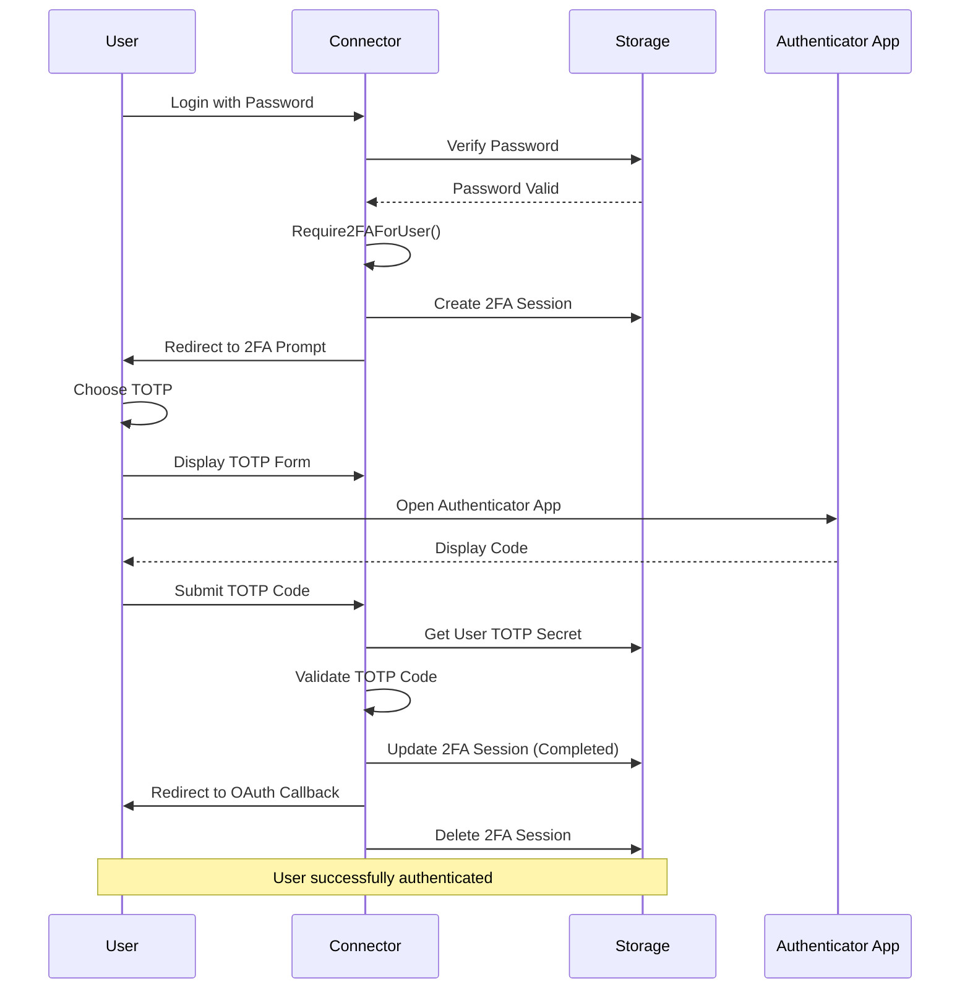
```mermaid
sequenceDiagram
    participant User
    participant Connector
    participant Storage
    participant Auth as Authenticator App

    User->>Connector: Login with Password
    Connector->>Storage: Verify Password
    Storage-->>Connector: Password Valid

    Connector->>Connector: Require2FAForUser()
    Connector->>Storage: Create 2FA Session
    Connector->>User: Redirect to 2FA Prompt

    User->>User: Choose TOTP
    User->>Connector: Display TOTP Form

    User->>Auth: Open Authenticator App
    Auth-->>User: Display Code
    User->>Connector: Submit TOTP Code

    Connector->>Storage: Get User TOTP Secret
    Connector->>Connector: Validate TOTP Code
    Connector->>Storage: Update 2FA Session (Completed)

    Connector->>User: Redirect to OAuth Callback
    Connector->>Storage: Delete 2FA Session

    Note over User,Storage: User successfully authenticated
```

### Magic Link Authentication Flow

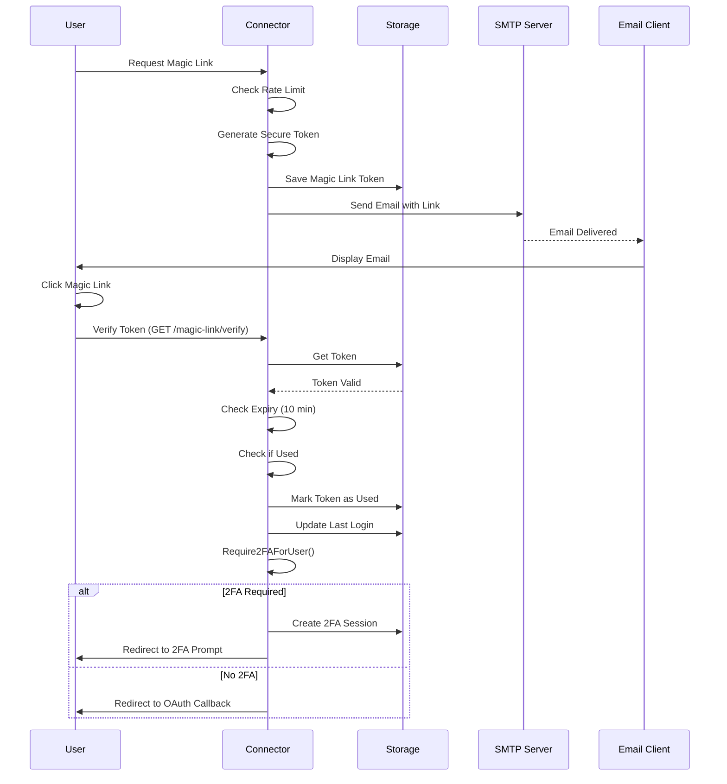
```mermaid
sequenceDiagram
    participant User
    participant Connector
    participant Storage
    participant Email as SMTP Server
    participant Browser as Email Client

    User->>Connector: Request Magic Link
    Connector->>Connector: Check Rate Limit

    Connector->>Connector: Generate Secure Token
    Connector->>Storage: Save Magic Link Token

    Connector->>Email: Send Email with Link
    Email-->>Browser: Email Delivered

    Browser->>User: Display Email
    User->>User: Click Magic Link

    User->>Connector: Verify Token (GET /magic-link/verify)
    Connector->>Storage: Get Token
    Storage-->>Connector: Token Valid

    Connector->>Connector: Check Expiry (10 min)
    Connector->>Connector: Check if Used

    Connector->>Storage: Mark Token as Used
    Connector->>Storage: Update Last Login

    Connector->>Connector: Require2FAForUser()

    alt 2FA Required
        Connector->>Storage: Create 2FA Session
        Connector->>User: Redirect to 2FA Prompt
    else No 2FA
        Connector->>User: Redirect to OAuth Callback
    end
```

### gRPC User Management Flow

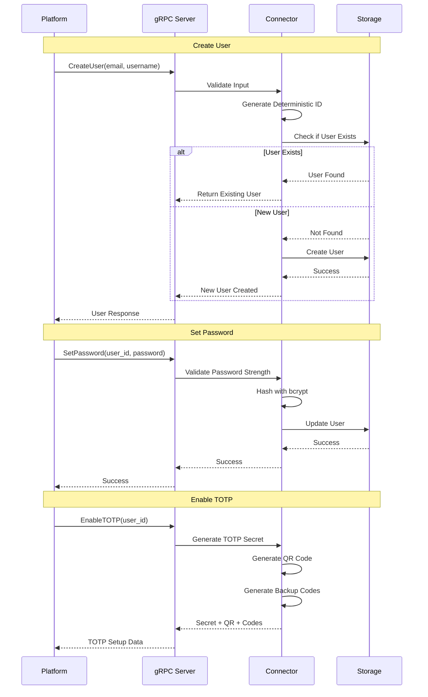
```mermaid
sequenceDiagram
    participant Platform
    participant gRPC as gRPC Server
    participant Connector
    participant Storage

    Note over Platform,Storage: Create User
    Platform->>gRPC: CreateUser(email, username)
    gRPC->>Connector: Validate Input
    Connector->>Connector: Generate Deterministic ID
    Connector->>Storage: Check if User Exists

    alt User Exists
        Storage-->>Connector: User Found
        Connector-->>gRPC: Return Existing User
    else New User
        Storage-->>Connector: Not Found
        Connector->>Storage: Create User
        Storage-->>Connector: Success
        Connector-->>gRPC: New User Created
    end

    gRPC-->>Platform: User Response

    Note over Platform,Storage: Set Password
    Platform->>gRPC: SetPassword(user_id, password)
    gRPC->>Connector: Validate Password Strength
    Connector->>Connector: Hash with bcrypt
    Connector->>Storage: Update User
    Storage-->>Connector: Success
    Connector-->>gRPC: Success
    gRPC-->>Platform: Success

    Note over Platform,Storage: Enable TOTP
    Platform->>gRPC: EnableTOTP(user_id)
    gRPC->>Connector: Generate TOTP Secret
    Connector->>Connector: Generate QR Code
    Connector->>Connector: Generate Backup Codes
    Connector-->>gRPC: Secret + QR + Codes
    gRPC-->>Platform: TOTP Setup Data
```

---

## Authentication Flows

### Complete Authentication Method Matrix

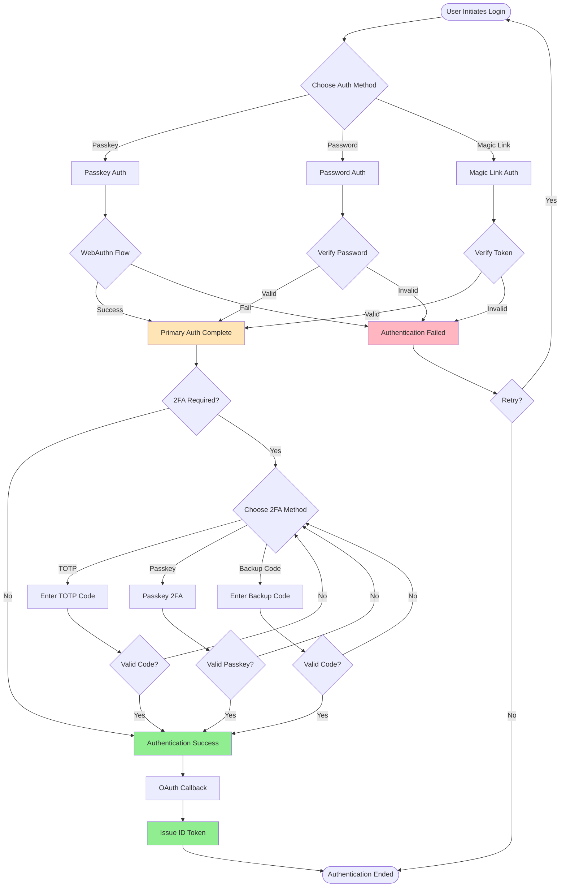
```mermaid
graph TB
    Start([User Initiates Login])

    Start --> Method{Choose Auth Method}

    Method -->|Passkey| Passkey[Passkey Auth]
    Method -->|Password| Password[Password Auth]
    Method -->|Magic Link| MagicLink[Magic Link Auth]

    Passkey --> PasskeyFlow{WebAuthn Flow}
    PasskeyFlow -->|Success| PrimaryAuth[Primary Auth Complete]
    PasskeyFlow -->|Fail| Error[Authentication Failed]

    Password --> PasswordFlow{Verify Password}
    PasswordFlow -->|Valid| PrimaryAuth
    PasswordFlow -->|Invalid| Error

    MagicLink --> TokenFlow{Verify Token}
    TokenFlow -->|Valid| PrimaryAuth
    TokenFlow -->|Invalid| Error

    PrimaryAuth --> Check2FA{2FA Required?}

    Check2FA -->|No| Success[Authentication Success]
    Check2FA -->|Yes| TwoFAPrompt{Choose 2FA Method}

    TwoFAPrompt -->|TOTP| TOTP[Enter TOTP Code]
    TwoFAPrompt -->|Passkey| PasskeySecond[Passkey 2FA]
    TwoFAPrompt -->|Backup Code| Backup[Enter Backup Code]

    TOTP --> ValidateTOTP{Valid Code?}
    ValidateTOTP -->|Yes| Success
    ValidateTOTP -->|No| TwoFAPrompt

    PasskeySecond --> ValidatePasskey{Valid Passkey?}
    ValidatePasskey -->|Yes| Success
    ValidatePasskey -->|No| TwoFAPrompt

    Backup --> ValidateBackup{Valid Code?}
    ValidateBackup -->|Yes| Success
    ValidateBackup -->|No| TwoFAPrompt

    Success --> OAuthCallback[OAuth Callback]
    OAuthCallback --> Token[Issue ID Token]

    Error --> Retry{Retry?}
    Retry -->|Yes| Start
    Retry -->|No| End([Authentication Ended])

    Token --> End

    style Success fill:#90EE90
    style Error fill:#FFB6C1
    style PrimaryAuth fill:#FFE4B5
    style Token fill:#90EE90
```

### 2FA Policy Decision Tree

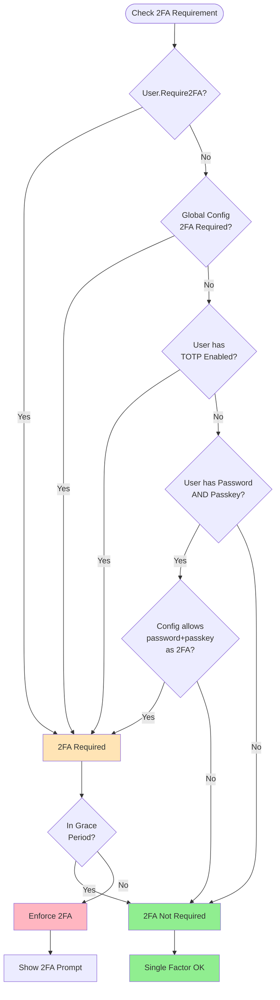
```mermaid
graph TD
    Start([Check 2FA Requirement])

    Start --> UserFlag{User.Require2FA?}
    UserFlag -->|Yes| Required[2FA Required]
    UserFlag -->|No| GlobalConfig

    GlobalConfig{Global Config<br/>2FA Required?}
    GlobalConfig -->|Yes| Required
    GlobalConfig -->|No| TOTPEnabled

    TOTPEnabled{User has<br/>TOTP Enabled?}
    TOTPEnabled -->|Yes| Required
    TOTPEnabled -->|No| BothMethods

    BothMethods{User has Password<br/>AND Passkey?}
    BothMethods -->|Yes| ConfigAllows
    BothMethods -->|No| NotRequired

    ConfigAllows{Config allows<br/>password+passkey<br/>as 2FA?}
    ConfigAllows -->|Yes| Required
    ConfigAllows -->|No| NotRequired

    Required --> GracePeriod{In Grace<br/>Period?}
    GracePeriod -->|Yes| NotRequired[2FA Not Required]
    GracePeriod -->|No| Enforce[Enforce 2FA]

    NotRequired --> Success[Single Factor OK]
    Enforce --> Prompt[Show 2FA Prompt]

    style Required fill:#FFE4B5
    style NotRequired fill:#90EE90
    style Enforce fill:#FFB6C1
    style Success fill:#90EE90
```

---

## Storage Architecture

### File Storage Structure

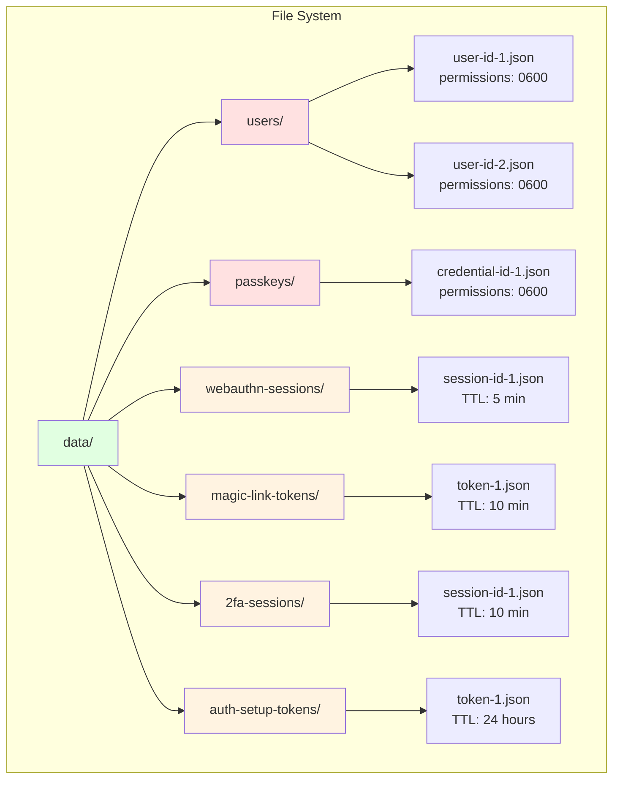
```mermaid
graph TB
    subgraph "File System"
        DataDir[data/]

        DataDir --> Users[users/]
        DataDir --> Passkeys[passkeys/]
        DataDir --> WebAuthnSessions[webauthn-sessions/]
        DataDir --> MagicTokens[magic-link-tokens/]
        DataDir --> TwoFASessions[2fa-sessions/]
        DataDir --> AuthSetup[auth-setup-tokens/]

        Users --> UserFile1[user-id-1.json<br/>permissions: 0600]
        Users --> UserFile2[user-id-2.json<br/>permissions: 0600]

        Passkeys --> PasskeyFile1[credential-id-1.json<br/>permissions: 0600]

        WebAuthnSessions --> Session1[session-id-1.json<br/>TTL: 5 min]

        MagicTokens --> Token1[token-1.json<br/>TTL: 10 min]

        TwoFASessions --> TwoFASession1[session-id-1.json<br/>TTL: 10 min]

        AuthSetup --> SetupToken1[token-1.json<br/>TTL: 24 hours]
    end

    style DataDir fill:#e1ffe1
    style Users fill:#ffe1e1
    style Passkeys fill:#ffe1e1
    style WebAuthnSessions fill:#fff3e1
    style MagicTokens fill:#fff3e1
    style TwoFASessions fill:#fff3e1
    style AuthSetup fill:#fff3e1
```

### User Data Model

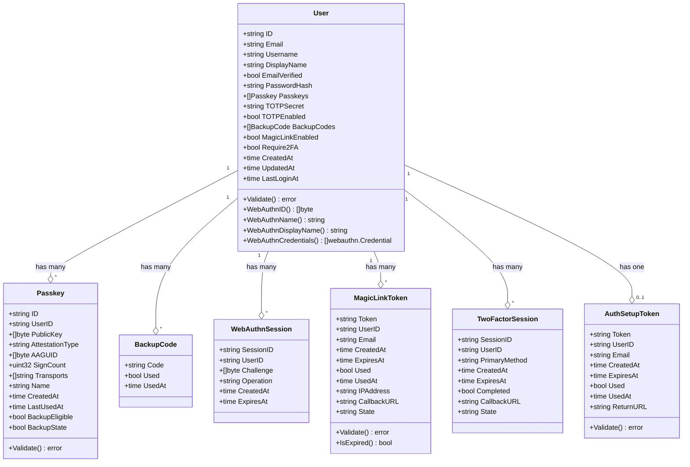
```mermaid
classDiagram
    class User {
        +string ID
        +string Email
        +string Username
        +string DisplayName
        +bool EmailVerified
        +string PasswordHash
        +[]Passkey Passkeys
        +string TOTPSecret
        +bool TOTPEnabled
        +[]BackupCode BackupCodes
        +bool MagicLinkEnabled
        +bool Require2FA
        +time CreatedAt
        +time UpdatedAt
        +time LastLoginAt
        +Validate() error
        +WebAuthnID() []byte
        +WebAuthnName() string
        +WebAuthnDisplayName() string
        +WebAuthnCredentials() []webauthn.Credential
    }

    class Passkey {
        +string ID
        +string UserID
        +[]byte PublicKey
        +string AttestationType
        +[]byte AAGUID
        +uint32 SignCount
        +[]string Transports
        +string Name
        +time CreatedAt
        +time LastUsedAt
        +bool BackupEligible
        +bool BackupState
        +Validate() error
    }

    class BackupCode {
        +string Code
        +bool Used
        +time UsedAt
    }

    class WebAuthnSession {
        +string SessionID
        +string UserID
        +[]byte Challenge
        +string Operation
        +time CreatedAt
        +time ExpiresAt
    }

    class MagicLinkToken {
        +string Token
        +string UserID
        +string Email
        +time CreatedAt
        +time ExpiresAt
        +bool Used
        +time UsedAt
        +string IPAddress
        +string CallbackURL
        +string State
        +Validate() error
        +IsExpired() bool
    }

    class TwoFactorSession {
        +string SessionID
        +string UserID
        +string PrimaryMethod
        +time CreatedAt
        +time ExpiresAt
        +bool Completed
        +string CallbackURL
        +string State
    }

    class AuthSetupToken {
        +string Token
        +string UserID
        +string Email
        +time CreatedAt
        +time ExpiresAt
        +bool Used
        +time UsedAt
        +string ReturnURL
        +Validate() error
    }

    User "1" --o "*" Passkey : has many
    User "1" --o "*" BackupCode : has many
    User "1" --o "*" WebAuthnSession : has many
    User "1" --o "*" MagicLinkToken : has many
    User "1" --o "*" TwoFactorSession : has many
    User "1" --o "0..1" AuthSetupToken : has one
```

### Storage Operations Flow

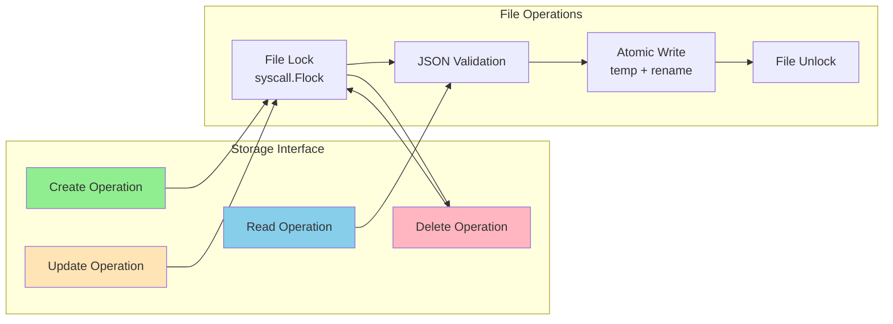
```mermaid
graph LR
    subgraph "Storage Interface"
        Create[Create Operation]
        Read[Read Operation]
        Update[Update Operation]
        Delete[Delete Operation]
    end

    subgraph "File Operations"
        Lock[File Lock<br/>syscall.Flock]
        Atomic[Atomic Write<br/>temp + rename]
        Unlock[File Unlock]
        Validate[JSON Validation]
    end

    Create --> Lock
    Update --> Lock
    Lock --> Validate
    Validate --> Atomic
    Atomic --> Unlock

    Read --> Validate
    Delete --> Lock
    Lock --> Delete

    style Create fill:#90EE90
    style Read fill:#87CEEB
    style Update fill:#FFE4B5
    style Delete fill:#FFB6C1
```

---

## Integration Architecture

### Platform to Dex Integration

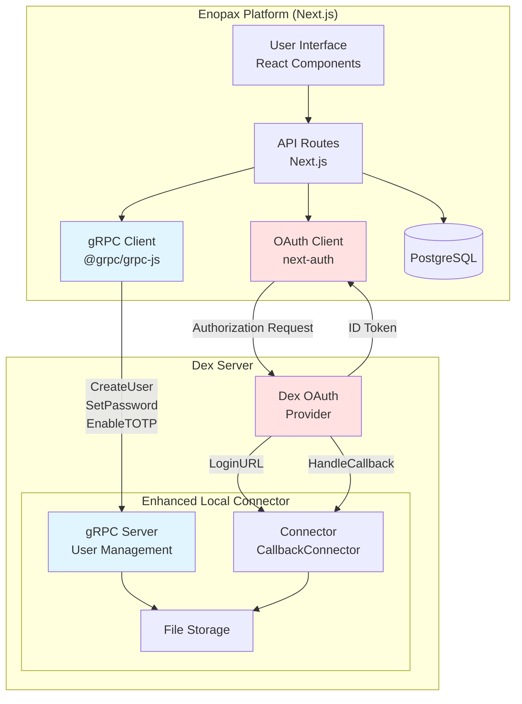
```mermaid
graph TB
    subgraph "Enopax Platform (Next.js)"
        UI[User Interface<br/>React Components]
        API[API Routes<br/>Next.js]
        gRPCClient[gRPC Client<br/>@grpc/grpc-js]
        OAuthClient[OAuth Client<br/>next-auth]
        DB[(PostgreSQL)]
    end

    subgraph "Dex Server"
        subgraph "Enhanced Local Connector"
            gRPCServer[gRPC Server<br/>User Management]
            Connector[Connector<br/>CallbackConnector]
            Storage[File Storage]
        end

        DexOAuth[Dex OAuth<br/>Provider]
    end

    UI --> API
    API --> gRPCClient
    API --> OAuthClient
    API --> DB

    gRPCClient -->|CreateUser<br/>SetPassword<br/>EnableTOTP| gRPCServer

    gRPCServer --> Storage
    Connector --> Storage

    OAuthClient -->|Authorization Request| DexOAuth
    DexOAuth -->|LoginURL| Connector
    DexOAuth -->|HandleCallback| Connector

    DexOAuth -->|ID Token| OAuthClient

    style gRPCClient fill:#e1f5ff
    style gRPCServer fill:#e1f5ff
    style OAuthClient fill:#ffe1e1
    style DexOAuth fill:#ffe1e1
```

### Multi-Tenant Architecture (Future)

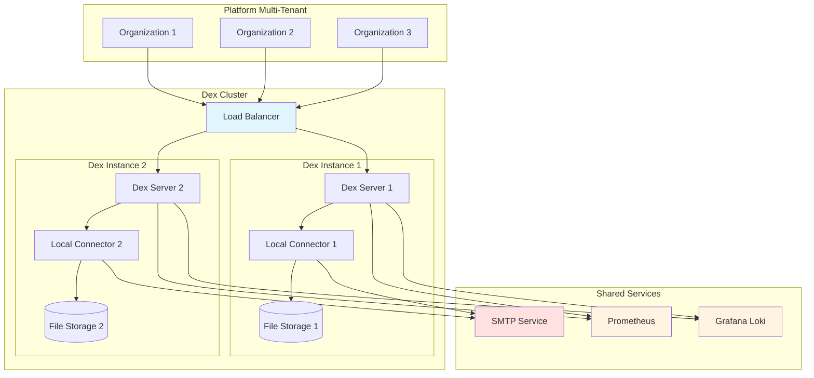
```mermaid
graph TB
    subgraph "Platform Multi-Tenant"
        Org1[Organization 1]
        Org2[Organization 2]
        Org3[Organization 3]
    end

    subgraph "Dex Cluster"
        LB[Load Balancer]

        subgraph "Dex Instance 1"
            Dex1[Dex Server 1]
            Connector1[Local Connector 1]
            Storage1[(File Storage 1)]
        end

        subgraph "Dex Instance 2"
            Dex2[Dex Server 2]
            Connector2[Local Connector 2]
            Storage2[(File Storage 2)]
        end
    end

    subgraph "Shared Services"
        SMTP[SMTP Service]
        Metrics[Prometheus]
        Logs[Grafana Loki]
    end

    Org1 --> LB
    Org2 --> LB
    Org3 --> LB

    LB --> Dex1
    LB --> Dex2

    Dex1 --> Connector1
    Dex2 --> Connector2

    Connector1 --> Storage1
    Connector2 --> Storage2

    Connector1 --> SMTP
    Connector2 --> SMTP

    Dex1 --> Metrics
    Dex2 --> Metrics

    Dex1 --> Logs
    Dex2 --> Logs

    style LB fill:#e1f5ff
    style SMTP fill:#ffe1e1
    style Metrics fill:#fff3e1
    style Logs fill:#fff3e1
```

---

## Security Architecture

### Security Layers

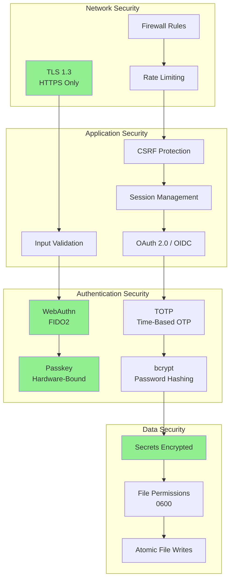
```mermaid
graph TB
    subgraph "Network Security"
        TLS[TLS 1.3<br/>HTTPS Only]
        Firewall[Firewall Rules]
        RateLimit[Rate Limiting]
    end

    subgraph "Application Security"
        InputVal[Input Validation]
        CSRF[CSRF Protection]
        SessionMgmt[Session Management]
        OAuth[OAuth 2.0 / OIDC]
    end

    subgraph "Authentication Security"
        WebAuthn[WebAuthn<br/>FIDO2]
        Passkey[Passkey<br/>Hardware-Bound]
        TOTP[TOTP<br/>Time-Based OTP]
        Bcrypt[bcrypt<br/>Password Hashing]
    end

    subgraph "Data Security"
        Encryption[Secrets Encrypted]
        FilePerms[File Permissions<br/>0600]
        AtomicWrites[Atomic File Writes]
    end

    TLS --> InputVal
    Firewall --> RateLimit
    RateLimit --> CSRF

    InputVal --> WebAuthn
    CSRF --> SessionMgmt
    SessionMgmt --> OAuth

    WebAuthn --> Passkey
    OAuth --> TOTP
    TOTP --> Bcrypt

    Bcrypt --> Encryption
    Encryption --> FilePerms
    FilePerms --> AtomicWrites

    style TLS fill:#90EE90
    style WebAuthn fill:#90EE90
    style Passkey fill:#90EE90
    style Encryption fill:#90EE90
```

### Threat Model

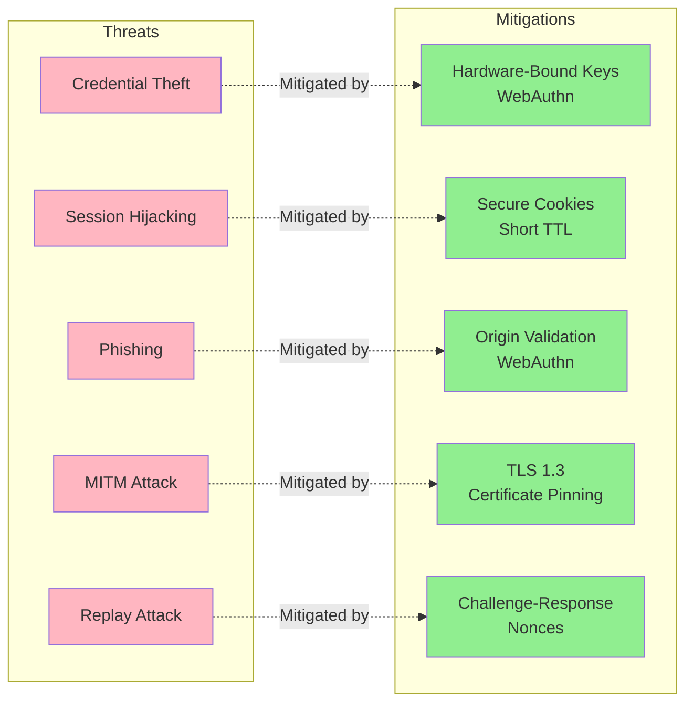
```mermaid
graph LR
    subgraph "Threats"
        T1[Credential Theft]
        T2[Session Hijacking]
        T3[Phishing]
        T4[MITM Attack]
        T5[Replay Attack]
    end

    subgraph "Mitigations"
        M1[Hardware-Bound Keys<br/>WebAuthn]
        M2[Secure Cookies<br/>Short TTL]
        M3[Origin Validation<br/>WebAuthn]
        M4[TLS 1.3<br/>Certificate Pinning]
        M5[Challenge-Response<br/>Nonces]
    end

    T1 -.->|Mitigated by| M1
    T2 -.->|Mitigated by| M2
    T3 -.->|Mitigated by| M3
    T4 -.->|Mitigated by| M4
    T5 -.->|Mitigated by| M5

    style T1 fill:#FFB6C1
    style T2 fill:#FFB6C1
    style T3 fill:#FFB6C1
    style T4 fill:#FFB6C1
    style T5 fill:#FFB6C1
    style M1 fill:#90EE90
    style M2 fill:#90EE90
    style M3 fill:#90EE90
    style M4 fill:#90EE90
    style M5 fill:#90EE90
```

---

## Performance Architecture

### Request Flow and Latency

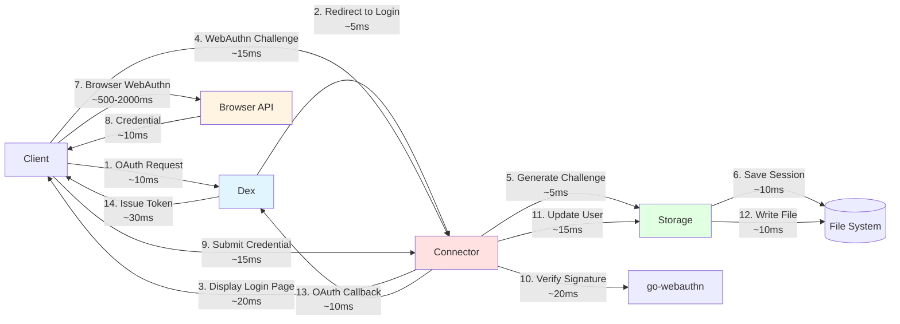
```mermaid
graph LR
    Client[Client] -->|1. OAuth Request<br/>~10ms| Dex
    Dex -->|2. Redirect to Login<br/>~5ms| Connector
    Connector -->|3. Display Login Page<br/>~20ms| Client

    Client -->|4. WebAuthn Challenge<br/>~15ms| Connector
    Connector -->|5. Generate Challenge<br/>~5ms| Storage
    Storage -->|6. Save Session<br/>~10ms| FS[(File System)]

    Client -->|7. Browser WebAuthn<br/>~500-2000ms| Browser[Browser API]
    Browser -->|8. Credential<br/>~10ms| Client

    Client -->|9. Submit Credential<br/>~15ms| Connector
    Connector -->|10. Verify Signature<br/>~20ms| Crypto[go-webauthn]
    Connector -->|11. Update User<br/>~15ms| Storage
    Storage -->|12. Write File<br/>~10ms| FS

    Connector -->|13. OAuth Callback<br/>~10ms| Dex
    Dex -->|14. Issue Token<br/>~30ms| Client

    style Dex fill:#e1f5ff
    style Connector fill:#ffe1e1
    style Storage fill:#e1ffe1
    style Browser fill:#fff3e1
```

**Total Latency Breakdown**:
- Network Overhead: ~100ms (steps 1-2, 4, 9, 13-14)
- Storage Operations: ~35ms (steps 6, 11-12)
- Cryptography: ~20ms (step 10)
- User Interaction: ~500-2000ms (step 7 - browser WebAuthn)
- **Total (excluding user interaction)**: ~155ms
- **p95 target**: <200ms ✅

### Scalability Considerations

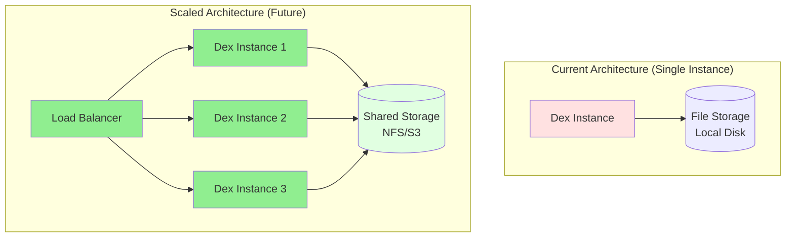
```mermaid
graph TB
    subgraph "Current Architecture (Single Instance)"
        Single[Dex Instance]
        FileStorage[(File Storage<br/>Local Disk)]
    end

    subgraph "Scaled Architecture (Future)"
        LB[Load Balancer]
        Instance1[Dex Instance 1]
        Instance2[Dex Instance 2]
        Instance3[Dex Instance 3]
        SharedStorage[(Shared Storage<br/>NFS/S3)]
    end

    Single --> FileStorage

    LB --> Instance1
    LB --> Instance2
    LB --> Instance3

    Instance1 --> SharedStorage
    Instance2 --> SharedStorage
    Instance3 --> SharedStorage

    style Single fill:#ffe1e1
    style LB fill:#90EE90
    style Instance1 fill:#90EE90
    style Instance2 fill:#90EE90
    style Instance3 fill:#90EE90
    style SharedStorage fill:#e1ffe1
```

---

## Deployment Architecture

### Production Deployment

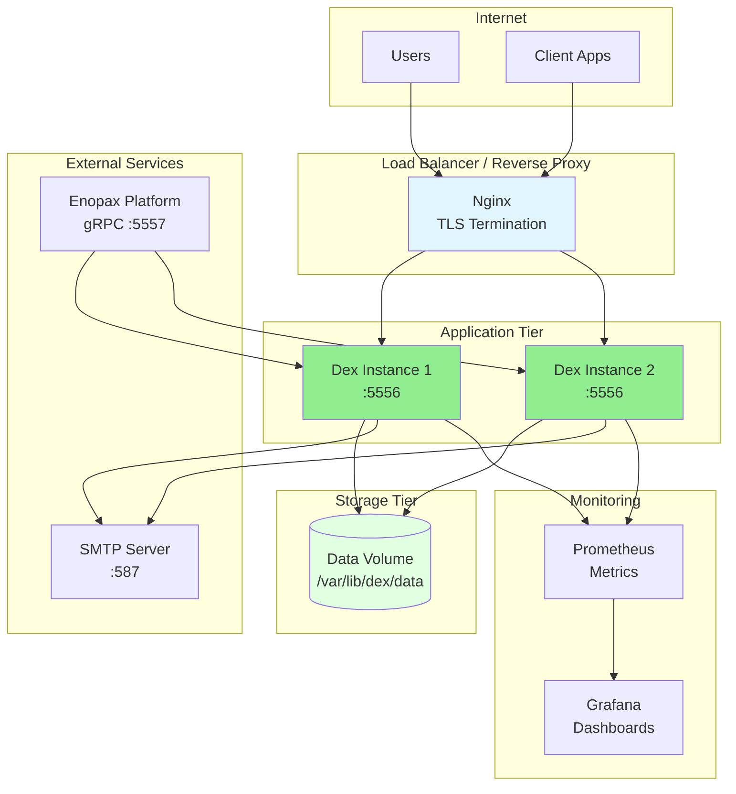
```mermaid
graph TB
    subgraph "Internet"
        Users[Users]
        Apps[Client Apps]
    end

    subgraph "Load Balancer / Reverse Proxy"
        Nginx[Nginx<br/>TLS Termination]
    end

    subgraph "Application Tier"
        Dex1[Dex Instance 1<br/>:5556]
        Dex2[Dex Instance 2<br/>:5556]
    end

    subgraph "Storage Tier"
        DataVol[(Data Volume<br/>/var/lib/dex/data)]
    end

    subgraph "External Services"
        SMTP[SMTP Server<br/>:587]
        Platform[Enopax Platform<br/>gRPC :5557]
    end

    subgraph "Monitoring"
        Prom[Prometheus<br/>Metrics]
        Graf[Grafana<br/>Dashboards]
    end

    Users --> Nginx
    Apps --> Nginx

    Nginx --> Dex1
    Nginx --> Dex2

    Dex1 --> DataVol
    Dex2 --> DataVol

    Dex1 --> SMTP
    Dex2 --> SMTP

    Platform --> Dex1
    Platform --> Dex2

    Dex1 --> Prom
    Dex2 --> Prom
    Prom --> Graf

    style Nginx fill:#e1f5ff
    style Dex1 fill:#90EE90
    style Dex2 fill:#90EE90
    style DataVol fill:#e1ffe1
```

### Container Architecture

```mermaid
graph TB
    subgraph "Docker Compose / Kubernetes"
        subgraph "Dex Container"
            DexProc[Dex Process<br/>Port 5556, 5557]
            Config[config.yaml]
            DataMount[/var/lib/dex/data]
        end

        subgraph "PostgreSQL Container (Platform)"
            PlatformDB[(PostgreSQL<br/>Port 5432)]
        end

        subgraph "Monitoring Stack"
            Prometheus[Prometheus<br/>Port 9090]
            Grafana[Grafana<br/>Port 3000]
        end
    end

    subgraph "Volumes"
        DexData[(dex-data)]
        PGData[(postgres-data)]
    end

    DexProc --> Config
    DexProc --> DataMount
    DataMount --> DexData
    PlatformDB --> PGData

    Prometheus --> DexProc
    Grafana --> Prometheus

    style DexProc fill:#e1f5ff
    style PlatformDB fill:#ffe1e1
    style Prometheus fill:#fff3e1
    style Grafana fill:#fff3e1
```

---

## Testing Architecture

### Test Pyramid

```mermaid
graph TB
    subgraph "Test Pyramid"
        E2E[End-to-End Tests<br/>e2e/*.go<br/>Playwright + Virtual Authenticator]

        Integration[Integration Tests<br/>*_integration_test.go<br/>Complete Flows]

        Unit[Unit Tests<br/>*_test.go<br/>Function-Level]
    end

    E2E --> Integration
    Integration --> Unit

    style E2E fill:#FFE4B5
    style Integration fill:#87CEEB
    style Unit fill:#90EE90
```

**Test Coverage**:
- Unit Tests: 79.0% coverage
- Integration Tests: All major flows
- E2E Tests: Passkey registration/authentication with virtual authenticator

### Test Infrastructure

```mermaid
graph LR
    subgraph "Test Utilities"
        TestUtils[testing.go<br/>Test Helpers]
        MockEmail[Mock Email Sender]
        TestData[Test Data Generators]
    end

    subgraph "Unit Tests"
        PasskeyTests[passkey_test.go]
        TOTPTests[totp_test.go]
        MagicLinkTests[magiclink_test.go]
        StorageTests[storage_test.go]
        ValidationTests[validation_test.go]
    end

    subgraph "Integration Tests"
        IntegrationTests[integration_test.go<br/>OAuth + Auth Flows]
    end

    subgraph "E2E Tests"
        E2ESetup[setup_test.go<br/>Playwright + Virtual Authenticator]
        PasskeyE2E[passkey_registration_test.go]
        AuthE2E[passkey_authentication_test.go]
        OAuthE2E[oauth_integration_test.go]
    end

    TestUtils --> PasskeyTests
    TestUtils --> TOTPTests
    TestUtils --> MagicLinkTests
    TestUtils --> StorageTests
    TestUtils --> ValidationTests

    MockEmail --> MagicLinkTests
    TestData --> PasskeyTests
    TestData --> TOTPTests

    TestUtils --> IntegrationTests
    E2ESetup --> PasskeyE2E
    E2ESetup --> AuthE2E
    E2ESetup --> OAuthE2E

    style TestUtils fill:#e1ffe1
    style IntegrationTests fill:#87CEEB
    style E2ESetup fill:#FFE4B5
```

---

## Glossary

- **WebAuthn**: Web Authentication API (W3C standard for passkeys)
- **FIDO2**: Fast Identity Online 2 (passkey authentication protocol)
- **TOTP**: Time-based One-Time Password (RFC 6238)
- **OIDC**: OpenID Connect (identity layer on OAuth 2.0)
- **RP**: Relying Party (application using WebAuthn)
- **AAGUID**: Authenticator Attestation GUID (identifies authenticator model)
- **Attestation**: Cryptographic proof of authenticator properties
- **Assertion**: Authentication response from authenticator
- **Discoverable Credential**: Passkey stored on authenticator (resident key)

---

**Last Updated**: 2025-11-18
**Version**: 1.0
**Maintainer**: Enopax Platform Team
